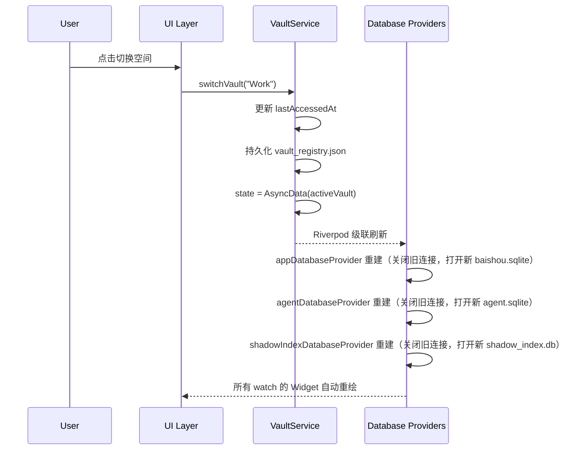

# 白守 — 多存储空间（Vault）架构设计

> 最后更新：2026-03-26

---

## 1. 设计目标

白守支持 **多个独立工作空间（Vault）**，每个空间拥有完全隔离的日记、总结、Agent 会话、向量记忆和文件系统。用户可以在运行时无缝切换空间，无需重启应用。

核心原则：**一个 Vault = 一套完整的数据孤岛**。

---

## 2. 物理目录结构

```
BaiShou_Root/                          ← 白守数据根目录
├── .baishou/                          ← 全局注册中心（跨 Vault 共享）
│   └── vault_registry.json            ← 空间注册表
│
├── Personal/                          ← Vault "Personal"
│   ├── .baishou/                      ← 系统元数据目录
│   │   ├── baishou.sqlite             ← 主数据库（日记 + 总结）
│   │   ├── agent.sqlite               ← Agent 数据库（会话 + 向量 + FTS）
│   │   └── shadow_index.db            ← 影子索引库（日记元数据缓存）
│   ├── Journals/                      ← 日记物理 Markdown 文件
│   │   └── 2026/03/2026-03-26.md
│   └── Archives/                      ← 总结物理 Markdown 文件
│       └── ...
│
├── Work/                              ← Vault "Work"（结构同上）
│   ├── .baishou/
│   │   ├── baishou.sqlite
│   │   ├── agent.sqlite
│   │   └── shadow_index.db
│   ├── Journals/
│   └── Archives/
│
└── ...（更多空间）
```

---

## 3. 数据库全览

白守共有 **3 个 Vault 级 SQLite 数据库** + **1 个全局注册文件** + **1 个全局 KV 存储**。

### 3.1 Vault 级数据库（切换空间时跟随切换）

| 数据库文件 | 技术栈 | 包含的表 | 用途 |
|---|---|---|---|
| `baishou.sqlite` | Drift + NativeDatabase | `diaries`, `summaries` | 日记内容和 AI 总结 |
| `agent.sqlite` | Drift + NativeDatabase + sqlite-vec | `agent_sessions`, `agent_messages`, `agent_parts`, `agent_assistants`, `compression_snapshots`, `memory_embeddings`(原生), `agent_messages_fts`(FTS5) | Agent 会话管理、消息存储、向量记忆、全文搜索 |
| `shadow_index.db` | sqlite3（直接操作） | `journals_index`, `journals_fts`(FTS5) | 日记文件的轻量元数据缓存与全文搜索 |

### 3.2 全局存储（切换空间时不切换）

| 存储 | 类型 | 用途 |
|---|---|---|
| `vault_registry.json` | JSON 文件 | 记录所有空间的名称、路径、创建时间、最后访问时间 |
| `SharedPreferences` | 系统 KV | 主题偏好、语言设置、API 密钥、快捷键配置、自定义根路径、侧边栏排序等 |

---

## 4. 各数据库详细说明

### 4.1 主数据库 — `baishou.sqlite`

**Provider**: `appDatabaseProvider`  
**文件位置**: `lib/core/database/app_database.dart`  
**Schema 版本**: 2

| 表名 | 说明 |
|---|---|
| `diaries` | 日记的结构化记录（id、日期、内容、天气、心情、位置等） |
| `summaries` | AI 生成的月度/周度总结（关联日期范围、摘要文本） |

### 4.2 Agent 数据库 — `agent.sqlite`

**Provider**: `agentDatabaseProvider`  
**文件位置**: `lib/agent/database/agent_database.dart`  
**Schema 版本**: 6

| 表名 | 说明 |
|---|---|
| `agent_sessions` | 对话会话（标题、创建/更新时间） |
| `agent_messages` | 对话消息（角色、token 用量、成本） |
| `agent_parts` | 消息的多模态内容块（文本、图片等） |
| `agent_assistants` | 助手/伙伴配置（名称、Emoji、系统提示词、排序） |
| `compression_snapshots` | 上下文压缩快照 |
| `memory_embeddings` | **向量记忆表**（source_type 区分 chat/diary，sqlite-vec SIMD 加速 KNN） |
| `agent_messages_fts` | **FTS5 全文搜索虚拟表**（消息内容索引） |

### 4.3 影子索引库 — `shadow_index.db`

**Provider**: `shadowIndexDatabaseProvider`  
**文件位置**: `lib/features/index/data/shadow_index_database.dart`  
**Schema 版本**: 2（PRAGMA user_version）

| 表名 | 说明 |
|---|---|
| `journals_index` | 日记文件的轻量元数据（路径、日期、hash、天气、心情、位置等） |
| `journals_fts` | **FTS5 全文搜索虚拟表**（日记正文 + tag 索引） |

> 影子索引库使用 `sqlite3` 包直接操作而非 Drift，可安全重建（从物理 Markdown 文件扫描恢复）。

---

## 5. Vault 切换机制

### 5.1 切换流程



### 5.2 关键代码路径

1. **触发**: `VaultService.switchVault(name)` 更新 `state`
2. **级联**: 三个数据库 Provider 均 `ref.watch(vaultServiceProvider)`，state 变更触发自动重建
3. **清理**: 每个 Provider 在 `ref.onDispose` 中关闭旧数据库连接
4. **UI 刷新**: 页面组件 watch 对应的 Provider，自动获取新数据

### 5.3 切换涉及的数据库清单

| 数据库 | 是否跟随切换 | Riverpod 依赖链 |
|---|---|---|
| `baishou.sqlite` | ✅ 是 | `vaultServiceProvider` → `appDatabaseProvider` |
| `agent.sqlite` | ✅ 是 | `vaultServiceProvider` → `agentDatabaseProvider` |
| `shadow_index.db` | ✅ 是 | `vaultServiceProvider` → `shadowIndexDatabaseProvider` |
| `vault_registry.json` | ❌ 全局共享 | 由 `VaultService` 直接管理 |
| `SharedPreferences` | ❌ 全局共享 | 不依赖 Vault |

---

## 6. 数据隔离保证

- **完全隔离**: 不同 Vault 的数据库文件位于不同物理目录，零共享
- **安全切换**: Drift 的 `LazyDatabase` 确保连接延迟打开，`onDispose` 确保旧连接正确关闭
- **可恢复性**: 影子索引库（`shadow_index.db`）可从物理 Markdown 文件全量重建
- **向后兼容**: 首次启动时自动将全局 SQLite 文件迁移到默认 "Personal" 空间

---

## 7. 创建新空间流程

1. 调用 `VaultService.switchVault("NewVault")`
2. 创建物理目录 `<Root>/NewVault/`
3. 初始化系统目录 `<Root>/NewVault/.baishou/`
4. 初始化日记目录 `<Root>/NewVault/Journals/`
5. 注册到 `vault_registry.json`
6. Riverpod 级联触发数据库 Provider 自动创建新的 SQLite 文件
